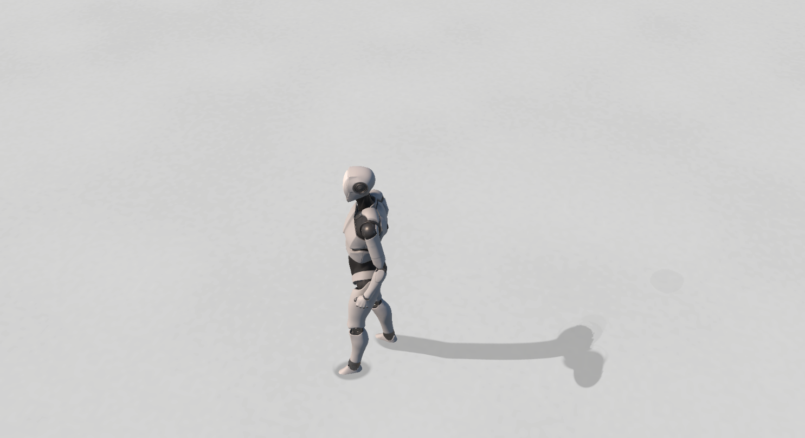
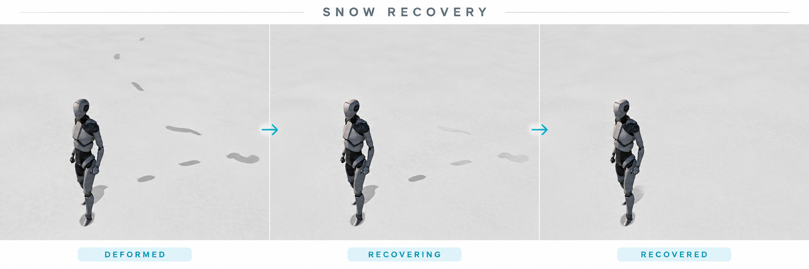
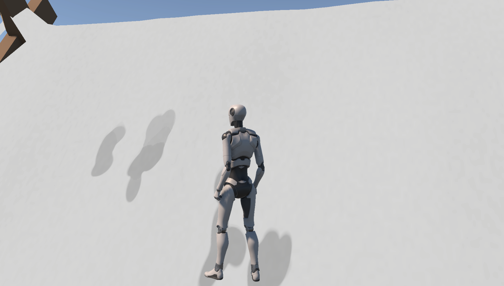

# Reactive Snow Surface System

Unity URP 환경에서 구현한 **GPU 기반 반응형 눈 표면 시스템**입니다.

캐릭터의 발처럼 표면과 접촉하는 대상을 `SurfaceBrush`로 변환하고, 해당 Brush가 지나간 영역을 GPU Surface State에 기록합니다.  
단순한 발자국 이펙트가 아니라 **접촉 위치·이동 궤적·압력에 따라 표면 상태가 누적되고 시간이 지나며 복원되는 구조**를 목표로 제작했습니다.

> 현재 저장소는 1차 완성본입니다.  
> Foot Contact 기반 눈 반응, Page 기반 GPU State 관리, Brush Stroke, 시간 복원까지 구현되어 있습니다.

---

## Demo

> 아래 이미지는 `Docs/Images`에 실제 플레이 캡처를 추가한 뒤 사용합니다.

### Walking / Foot Contact


캐릭터의 발이 눈 표면에 접촉하면 Brush가 생성되며, 이동에 따라 연속적인 자국이 기록됩니다.

### Continuous Brush Stroke



접촉 상태에서 발이 움직이면 이전 위치와 현재 위치 사이를 하나의 Brush Stroke로 처리합니다.  
이를 통해 제자리 회전이나 발 끌기에서도 끊어진 Stamp가 아닌 연속적인 흔적을 만들 수 있습니다.

### Recovery



기록된 Surface State는 일정 시간 유지된 뒤 서서히 원상 복구됩니다.

### Sloped / Elevated Surface



평지뿐 아니라 경사면과 지붕처럼 높이가 다른 표면에서도 동일한 Reactive Surface 흐름을 사용할 수 있도록 구성했습니다.

---

## Core Flow

```text
Character Contact
       ↓
  SurfaceBrush
       ↓
   SnowSurface
       ↓
 Logical Tile / State Page
       ↓
 SnowStateStorage
       ↓
 Compute Shader
       ↓
 GPU Surface State
       ↓
 Snow Shader Rendering
```

핵심은 **접촉 검출과 표면 반응을 분리한 것**입니다.

`SnowInteractor`는 캐릭터의 접촉 정보를 Brush로 만들어 주는 데모 입력 계층이고, 실제 Surface 시스템은 Brush가 어떤 오브젝트에서 생성되었는지 알 필요가 없습니다.

---

## Surface Brush

`SurfaceBrush`는 표면에 전달되는 최소한의 상호작용 데이터입니다.

```csharp
public readonly struct SurfaceBrush
{
    public Vector3 PreviousPosition { get; }
    public Vector3 Position { get; }
    public Vector3 Direction { get; }
    public float Pressure { get; }
    public SnowStampProfile Profile { get; }
}
```

이전 위치와 현재 위치를 함께 전달하기 때문에 매 프레임 원형 Stamp를 반복해서 찍는 대신, Compute Shader에서 **Brush가 이동한 구간 전체를 Sweep**할 수 있습니다.

현재는 발 접촉을 기준으로 사용하고 있지만 동일한 입력 구조를 검, 타이어, 박스 Drag 등의 Contact Source에도 확장할 수 있습니다.

---

## GPU Surface State

눈의 상태는 CPU Mesh 데이터가 아니라 `Texture2DArray` 기반 GPU State로 관리합니다.

현재 State 채널은 다음 용도로 사용합니다.

| Channel | Meaning |
| --- | --- |
| R | Depression |
| G | Compression |
| B | Displacement |
| A | Reserved / Surface State |

기본 포맷은 `R8G8B8A8_UNorm`이며, Compute Shader가 Brush 영역의 State를 갱신합니다.

이를 통해 CPU에서 고밀도 Mesh Vertex를 직접 수정하지 않고도 작은 발자국과 연속적인 흔적을 표현할 수 있습니다.

---

## Page-based State Management

넓은 표면 전체에 고해상도 RenderTexture를 할당하지 않고, 논리적인 Tile과 GPU State Page를 분리했습니다.

기본 구성:

```text
Logical Tile : 16 m
State Page   : 4 m
Resolution   : 512 × 512 / Page
```

한 Tile 내부에 여러 State Page가 존재할 수 있으며, **실제로 Brush가 닿은 Page만 GPU Slice를 할당**합니다.

`SnowStateStorage`는 제한된 Slice Pool을 관리하며, 용량이 부족하면 오래 사용되지 않은 Page를 LRU 방식으로 재사용합니다.

---

## Recovery

각 State Page에는 Surface State와 별도로 Age Texture가 존재합니다.

Brush가 픽셀을 갱신하면 해당 픽셀의 Age가 초기화되고, 일정 시간이 지난 뒤 State가 점진적으로 감소합니다.

현재 테스트 기준:

```text
Lifetime          : 5 sec
Fade Duration     : 2 sec
Recovery Interval : 0.25 sec
```

따라서 최근에 밟힌 영역과 오래된 영역이 서로 다른 시점에 복원됩니다.

---

## Optimization

현재 1차 완성본에서 적용한 최적화 방향입니다.

- 필요한 State Page만 GPU Slice 할당
- `Texture2DArray` 기반 공유 State Storage
- 제한된 Page Capacity + LRU 재사용
- Foot Contact 검사에 `RaycastNonAlloc` 사용
- Brush가 일정 거리 이상 이동했을 때만 Stroke 적용
- CPU Vertex 변형 대신 Compute Shader에서 Surface State 갱신
- 상태가 일정 시간 뒤 자동 복원되어 장기 누적 방지

Snow Cover 생성용 Baker는 데모 환경 구성을 위한 Authoring Tool이며, 본 시스템의 핵심 런타임 구조와 분리되어 있습니다.

---

## Main Components

### `SnowSurface`
Reactive Surface의 좌표 공간과 Tile/Page를 관리하고, Brush가 영향을 주는 State Page를 결정합니다.

### `SnowStateStorage`
GPU Texture2DArray, Page Slice Pool, LRU, Brush Compute Dispatch, Recovery를 관리합니다.

### `SnowState.compute`
Brush Sweep을 Surface State에 기록하고 시간에 따른 복원을 처리합니다.

### `SnowSurfaceState.shader`
저장된 Surface State를 읽어 눈의 색상, 깊이감, Normal/Parallax 표현에 반영합니다.

### `SnowInteractor`
Humanoid 발 위치에서 Surface Contact를 검출하고 `SurfaceBrush`를 생성하는 데모 입력 코드입니다.

### `SnowSurfaceUtility`
좌표 변환과 Page/Tile 계산처럼 상태를 가지지 않는 수학 로직을 분리한 Utility입니다.

---

## Project Structure

```text
ReactiveSnow_Portfolio_FirstComplete/
├─ SnowData.cs
├─ SnowSurface.cs
├─ SnowSurfaceUtility.cs
├─ SnowStateStorage.cs
├─ SnowStampProfile.cs
├─ SnowInteractor.cs
├─ SnowSurfaceBaker.cs
├─ Shader/
│  ├─ SnowState.compute
│  └─ SnowSurfaceState.shader
├─ Docs/
│  └─ Images/
├─ README.md
└─ README_CAPTURE_GUIDE.md
```

---

## Current Status

### First Complete

- [x] Foot Contact
- [x] Continuous Brush Stroke
- [x] Page Boundary 대응
- [x] Sparse GPU Page Allocation
- [x] LRU Page Reuse
- [x] Surface State Recovery
- [x] Slope / Elevated Surface Test
- [x] Runtime Footprint Rendering

### Next

- [ ] Sword / Weapon Brush Source
- [ ] Wheel Contact
- [ ] Rigidbody / Drag Contact
- [ ] NPC Distance LOD
- [ ] Snow Cover Visual Quality
- [ ] Sand / Mud Surface Profile
- [ ] Generalized Reactive Surface naming/refactor

---

## Environment

- Unity 6
- Universal Render Pipeline
- Compute Shader
- HLSL / C#

---

## Notes

본 프로젝트는 특정 상용 게임의 내부 구현을 재현하거나 분석한 코드가 아니라, 눈 위 상호작용 표현을 참고하여 직접 설계한 Reactive Surface 구현입니다.

현재 저장소는 이력서 및 포트폴리오 제출을 위한 **1차 완성본**이며, 이후 다른 Contact Source와 Surface Material로 확장할 예정입니다.
