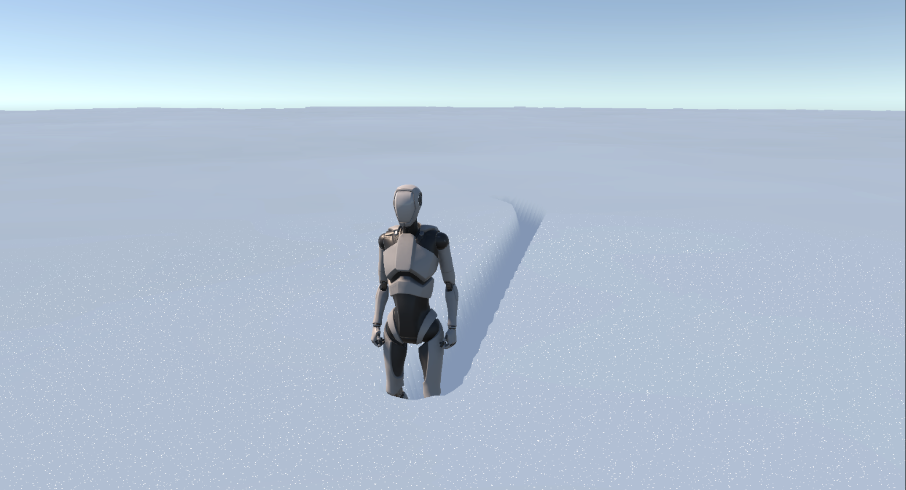
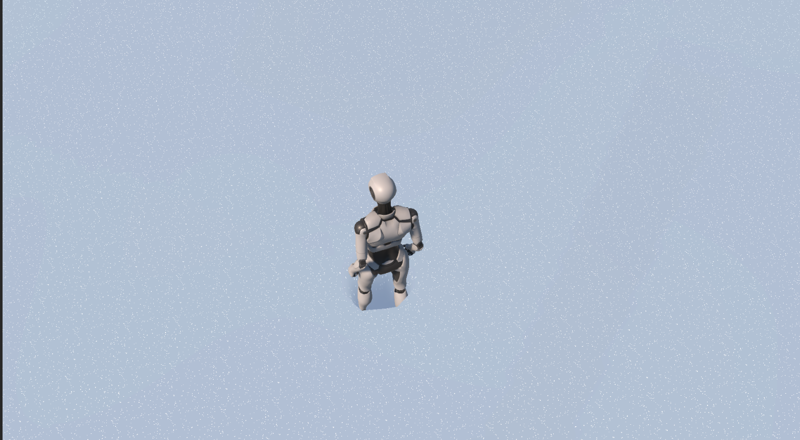
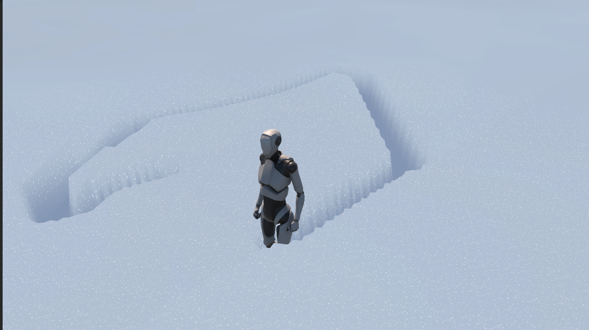
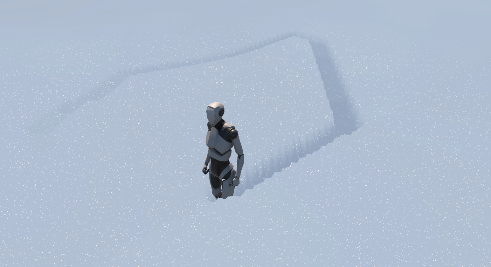
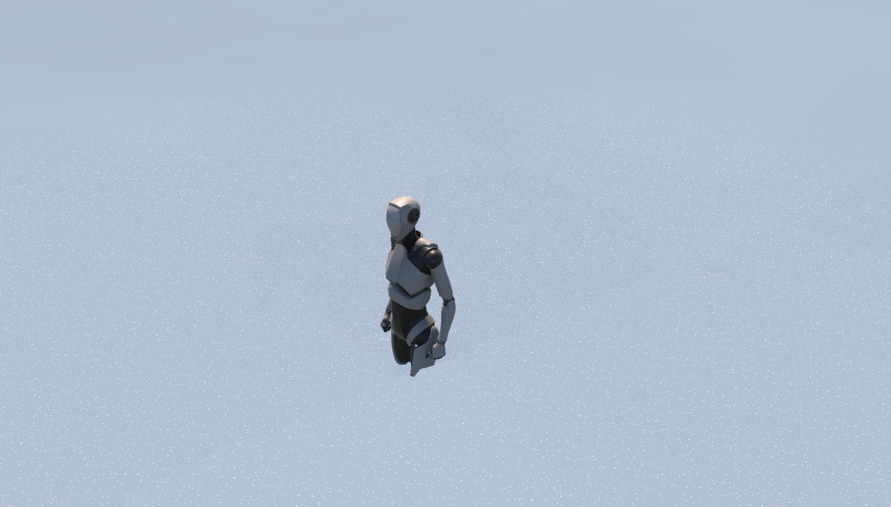
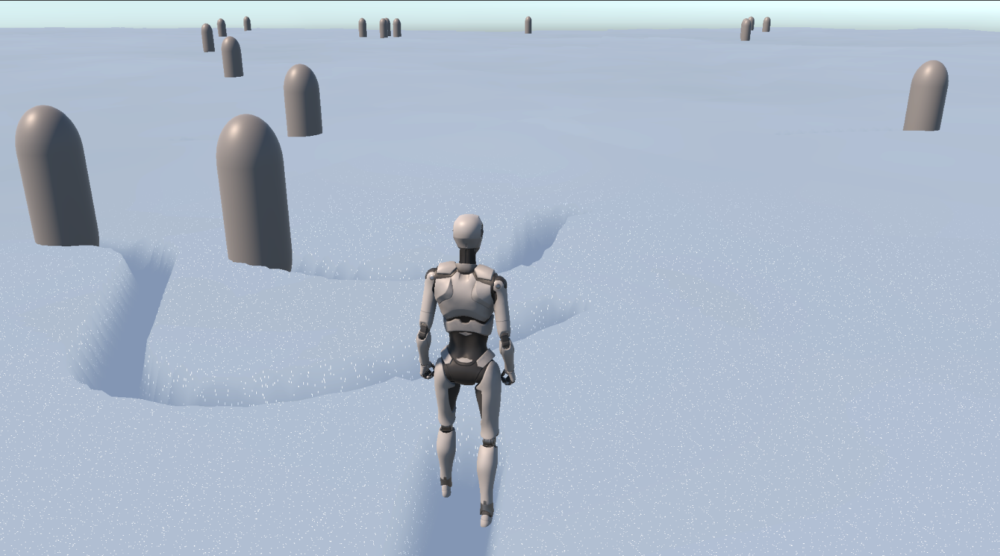
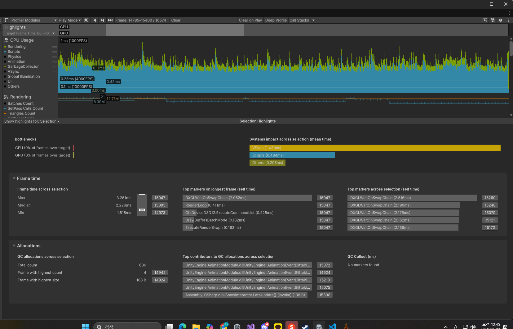

# Reactive Snow Surface System

Unity 6 URP에서 구현한 GPU 기반 반응형 눈 표면 시스템입니다. 캐릭터의 접촉과 이동 경로를 Compute Shader로 기록하고, 제한된 GPU Page를 실제 상호작용 영역에만 할당합니다.

캐릭터가 눈 위를 이동하면 접촉 지점 사이를 연속적인 Brush Stroke로 연결하여 눌림과 밀려남을 기록합니다. 생성된 흔적은 픽셀마다 유지 시간을 계산해 순차적으로 복원되며, 다수의 NPC가 존재하는 환경에서는 플레이어 주변의 접촉만 선별적으로 갱신합니다.

주요 기능은 다음과 같습니다.

- 절차적 Noise를 이용한 불규칙한 적설 높이 표현
- 이동 경로와 압력을 반영한 연속적인 눈 표면 변형
- 실제 접촉 영역에만 GPU Page를 할당하는 Sparse State 관리
- Page 우선순위와 보호 시간을 이용한 플레이어 흔적 보존
- 픽셀별 Age Texture를 이용한 시간 기반 표면 복원
- Spatial Hash와 거리 단계화를 이용한 다중 Agent 최적화



## Preview

### Procedural Snow Surface



여러 크기의 절차적 Noise로 적설 높이를 구성하고, Sparkle은 플레이어와의 거리에 따라 제한합니다.

### Surface Recovery

| Recorded | Recovering | Recovered |
| :---: | :---: | :---: |
|  |  |  |

흔적은 픽셀별 Age를 기준으로 유지되며, Lifetime 이후 점진적으로 복원됩니다.

### Multi-Agent Test



플레이어의 흔적을 우선 보존하고, NPC 접촉 검사는 플레이어와의 거리 및 이동 여부에 따라 조절합니다.

## How It Works

```text
SurfaceContactAgent
        ↓
SurfaceContactSystem
        ↓
SnowInteractor → SurfaceBrush
        ↓
SnowSurface → SnowStateStorage
        ↓
SnowState.compute → SnowSurfaceState.shader
```

접촉 검출, Brush 생성, Page 관리와 GPU 상태 갱신을 분리했습니다. `SnowInteractor`는 이전 위치와 현재 위치를 하나의 Stroke로 전달하여 빠른 이동에서도 흔적이 끊기지 않도록 처리합니다.

## GPU State

| Channel | Value |
| :---: | --- |
| R | Depression |
| G | Compression |
| B | Displacement |
| A | Reserved |

| Setting | Default |
| --- | ---: |
| Page Size | `8 m` |
| Page Resolution | `512 × 512` |
| Page Capacity | `32 slices` |
| State Format | `R8G8B8A8_UNorm` |
| Age Format | `R16_SFloat` |
| Footprint Lifetime | `5 sec` |
| Fade Duration | `2 sec` |
| Recovery Interval | `0.25 sec` |

Compute Shader는 전체 Page가 아닌 Brush가 차지하는 픽셀 범위만 Dispatch합니다. 복원이 끝난 Page는 Slice를 반환해 장기적인 상태 누적을 방지합니다.

## Profiling



Unity Editor에서 200 Agent를 200 × 200 영역에 배치한 측정 결과입니다.

| Metric | Result |
| --- | ---: |
| Scripts Mean | `0.484 ms` |
| Frame Median | `2.226 ms` |
| Frame Max | `3.261 ms` |
| GC Collect | `0 ms` |

측정값에는 Editor와 VSync 대기 시간이 포함되어 있으며, 구조 변경 전후의 상대 비교 기준으로 사용했습니다.

## Core Code

### [`SnowStateStorage.cs`](Scripts/SnowStateStorage.cs)

공유 `Texture2DArray`와 Slice Pool을 소유하는 GPU 상태 관리자입니다. 요청된 Page에 Slice를 할당하고, Capacity가 가득 차면 복원 상태·우선순위·보호 시간·최근 사용 시점을 비교해 재사용할 Page를 선택합니다. Brush 기록과 Recovery Compute Dispatch도 이 클래스에서 한 흐름으로 관리합니다.

### [`SurfaceContactSystem.cs`](Scripts/SurfaceContactSystem.cs)

등록된 Surface를 Spatial Hash Cell에 분류하고 Agent가 위치한 Cell의 후보만 검사합니다. 플레이어는 항상 갱신하지만 NPC는 진입·이탈 거리, 이동량과 갱신 주기를 기준으로 검사 빈도를 조절하여 Agent 수가 늘어날 때의 CPU 비용을 제한합니다.

### [`SnowSurface.cs`](Scripts/SnowSurface.cs)

하나의 눈 표면이 사용하는 좌표 공간과 논리 Page를 관리합니다. World 좌표로 전달된 Brush 범위를 Surface 좌표로 변환하고, 영향을 받는 Page만 찾아 `SnowStateStorage`에 전달합니다. 할당된 Slice 정보는 Page Map Texture로 Shader에 연결합니다.

### [`SnowState.compute`](Shaders/SnowState.compute)

이전 접촉 위치와 현재 위치 사이의 선분을 Sweep하여 Depression, Compression, Displacement 채널을 갱신합니다. 별도의 Age Texture에는 픽셀별 경과 시간을 기록하고, Lifetime 이후 각 상태를 Fade Duration에 맞춰 복원합니다.

### [`SnowSurfaceState.shader`](Shaders/SnowSurfaceState.shader)

절차적 Noise로 생성한 기본 적설 높이와 GPU State를 결합해 최종 Vertex 변위를 계산합니다. 눌림과 밀려남을 색상 및 Normal 표현에도 반영하며, Sparkle은 플레이어와의 거리에 따라 Fade 처리합니다.

## Setup

1. Scene에 `SurfaceContactSystem`과 `SnowStateStorage`를 추가하고 Compute Shader를 지정합니다.
2. 눈 Mesh에 Snow Material과 `SnowSurface`를 추가합니다.
3. 접촉 대상에 Collider, `SurfaceContactAgent`, `SnowInteractor`를 추가합니다.
4. `SnowInteractor`에 Storage와 `SnowStampProfile`을 지정합니다.

## Environment

- Unity 6
- Universal Render Pipeline
- C# / HLSL / Compute Shader
