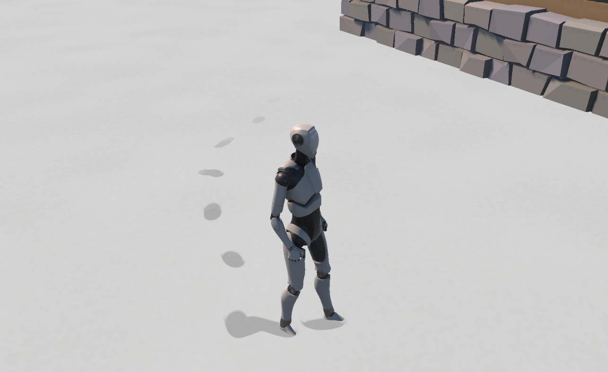

# Unity Lab

실제 게임에서 흥미롭게 느낀 그래픽 및 게임플레이 기술을 분석하고, Unity 환경에서 직접 구현한 기술 데모 모음입니다.

기능을 단순히 재현하는 데 그치지 않고, 동작 구조와 성능 비용을 분석하여 확장 가능한 형태로 설계하는 것을 목표로 합니다.

---

## Projects

| Project | Summary | Key Topics | Links |
|---|---|---|---|
| WorldView Box | 경계면 너머에 별도의 공간이 존재하는 듯한 표현을 구현한 Cubemap 기반 월드 뷰 시스템 | Cubemap, Editor Baking, Profiling, Memory Optimization | [README](./WorldViewBox) · [Demo](https://youtu.be/lyvdPmv64Qs) |
| Reactive Snow Surface System | 접촉 위치와 이동 궤적에 따라 눈이 변형되고 시간에 따라 복원되는 GPU 기반 반응형 표면 시스템 | Compute Shader, GPU State, Sparse Page, Surface Recovery | [README](./ReactiveSurface) |

---

## WorldView Box

정적인 이공간을 Cubemap으로 Bake하여 실시간 6방향 렌더링 비용을 제거하고, 하나의 Cube Renderer에서 내부 월드와 유리 표면을 함께 표현했습니다.

**[프로젝트 상세 보기 →](./WorldViewBox)**  
**[영상 보기 →](https://youtu.be/lyvdPmv64Qs)**

---

## Reactive Snow Surface System

캐릭터와 오브젝트의 접촉을 Brush 데이터로 변환하고, 이동 궤적과 압력에 따른 표면 변형을 GPU State에 누적합니다. 기록된 흔적은 픽셀별 경과 시간에 따라 자연스럽게 복원됩니다.

**[프로젝트 상세 보기 →](./ReactiveSurface)**

---

## Environment

- Unity 6
- Universal Render Pipeline
- C#
- HLSL
- Compute Shader
