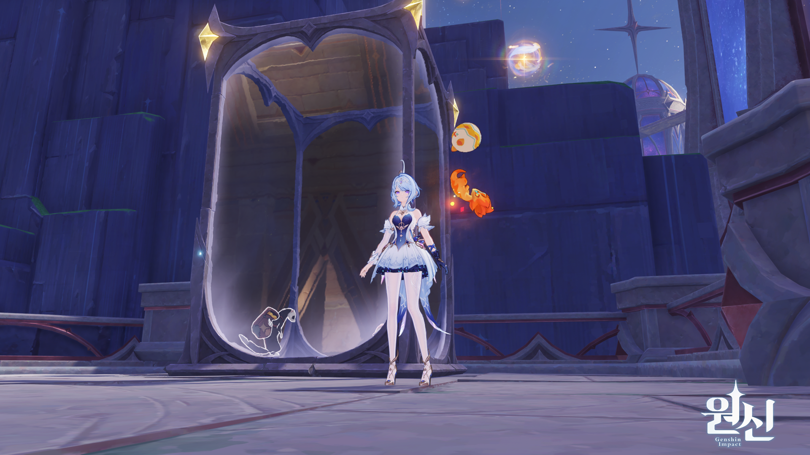
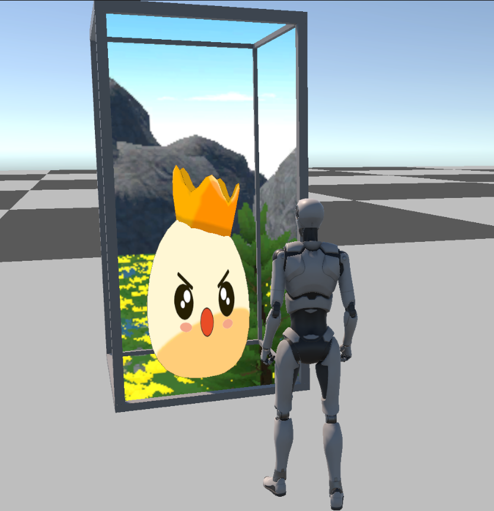
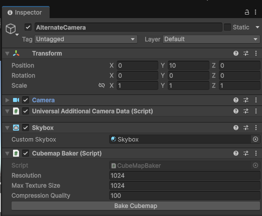
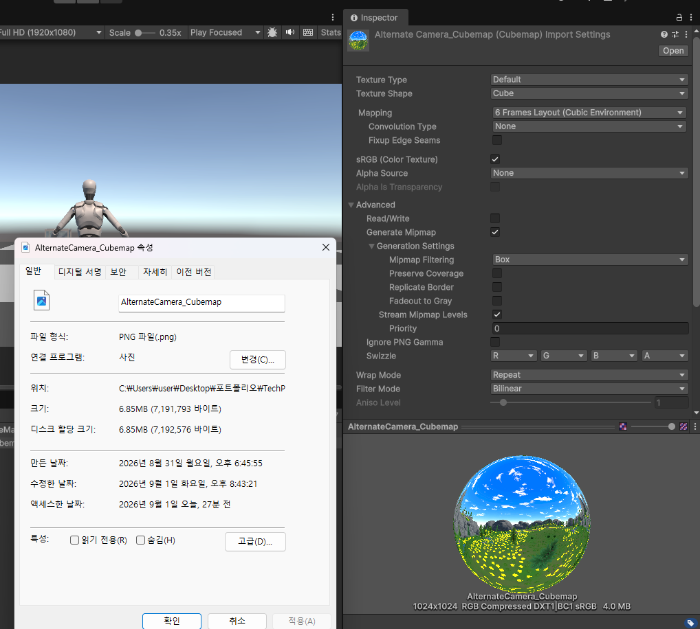
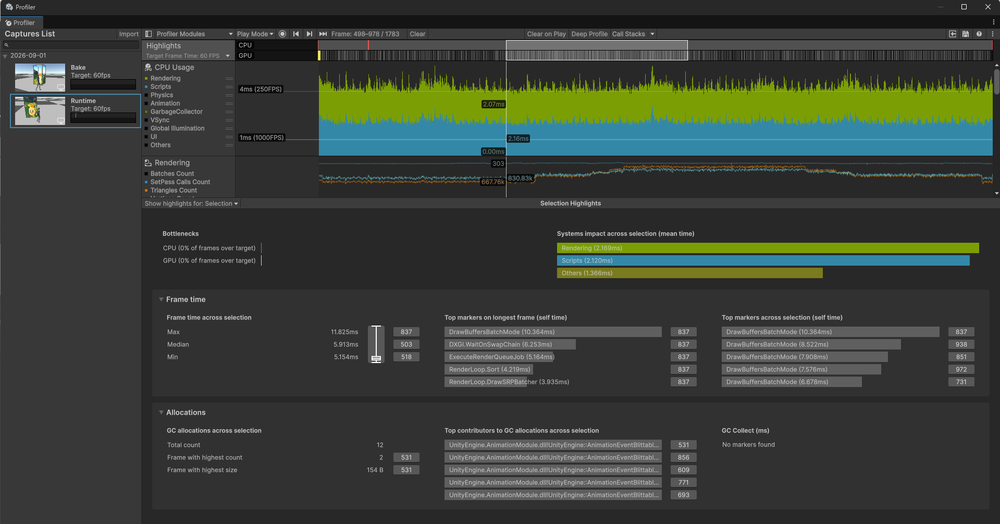
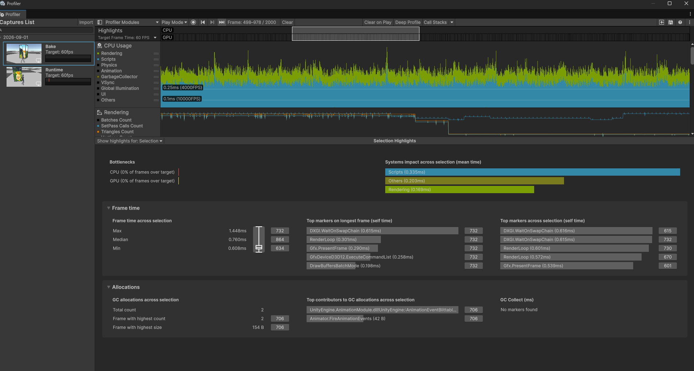

# WorldView Box

> Genshin Impact 「공간의 신전」의 거울/이공간 표현을 Visual Reference로 삼아,  
> Unity URP에서 Cubemap 기반의 Alternate World 표현과 최적화 방식을 구현한 기술 프로토타입입니다.

[[[](https://youtu.be/lyvdPmv64Qs)](https://youtu.be/lyvdPmv64Qs)](https://youtu.be/lyvdPmv64Qs)

---

## Overview

거울 또는 경계면 너머에 별도의 공간이 존재하는 듯한 표현을 구현했습니다.

초기에는 `Camera.RenderToCubemap()` 기반의 실시간 Cubemap을 사용했지만,  
정적 환경까지 매 프레임 6방향으로 다시 렌더링하는 비용이 발생했습니다.

이를 개선하기 위해 정적 환경은 Editor에서 Cubemap으로 Bake하고,  
런타임에서는 미리 생성된 Cubemap을 샘플링하는 방식으로 전환했습니다.

```text
Runtime Cubemap
Alternative Camera
→ RenderToCubemap
→ 6 Direction Rendering

Baked Cubemap
Editor Bake
→ 1024 Cubemap
→ BC1 Compression
→ Runtime Texture Sampling
```

---

## Tech Stack

- **Unity 6**
- **Universal Render Pipeline**
- **HLSL / URP Shader**
- **Cubemap / RenderTexture**
- **Camera.RenderToCubemap**
- **TextureImporter**
- **BC1(DXT1) / BC7 Compression**
- **MaterialPropertyBlock**
- **Unity Profiler / Profile Analyzer**

---

## Reference

| Visual Reference | Unity Implementation |
|---|---|
|  |  |

**Visual Reference:** Genshin Impact - 공간의 신전

- 경계면 너머에 별도의 공간이 존재하는 듯한 깊이감
- 시점 변화에 따른 내부 공간 표현
- 유리/거울 계열의 표면 표현

원본 게임의 내부 렌더링 구조를 복제한 것이 아니라,  
시각적 특징을 기준으로 Cubemap 기반 구현 방식을 설계했습니다.

---

## Implementation

### Runtime Cubemap

초기 방식은 별도 Camera에서 `Camera.RenderToCubemap()`을 호출해 Alternate World를 실시간으로 캡처했습니다.

```text
Alternative World
      ↓
Alternative Camera
      ↓
RenderToCubemap
      ↓
Cubemap RenderTexture
      ↓
GlassWorld Shader
```

동적인 환경을 그대로 표현할 수 있다는 장점이 있지만,  
Cubemap의 6개 Face마다 Alternate World를 다시 렌더링해야 합니다.

### Static Cubemap Baking

정적인 월드는 런타임에서 반복 렌더링할 필요가 없다고 판단해 Editor Bake 방식으로 전환했습니다.



```text
Alternate World
      ↓
CubemapBaker
      ↓
1024 Cubemap
      ↓
BC1 / BC7
      ↓
CubemapSurface
```

`CubemapBaker`는 Editor에서 Camera의 6방향을 캡처해 Cubemap Texture를 생성합니다.

핵심 Bake 로직은 런타임 렌더링을 Editor 단계로 옮기는 역할만 담당하도록 단순하게 유지했습니다.

```csharp
public void Bake(string path)
{
    Texture2D strip = Capture();
    File.WriteAllBytes(path, strip.EncodeToPNG());
    DestroyImmediate(strip);

    AssetDatabase.Refresh();
    Import(path);
}
```

전체 코드: [`CubemapBaker.cs`](Editor/CubemapBaker.cs)

런타임에서는 `Camera.RenderToCubemap()`을 사용하지 않고,  
`MaterialPropertyBlock`으로 Renderer별 Cubemap만 전달합니다.

```csharp
void Apply()
{
    targetRenderer.GetPropertyBlock(block);
    block.SetTexture(propertyId, cubemap);
    targetRenderer.SetPropertyBlock(block);
}
```

전체 코드: [`CubemapSurface.cs`](Runtime/CubemapSurface.cs)

---

## GlassWorld Shader

하나의 Cube Mesh에서 두 개의 Pass를 사용합니다.

```text
World Pass
Cull Front
→ Back Face
→ Cubemap Sampling

Glass Pass
Cull Back
→ Front Face
→ Fresnel Glass
```

World Pass에서는 카메라와 현재 Fragment 위치를 기준으로 Cubemap 방향을 계산합니다.

```hlsl
half4 FragWorld(Varyings input) : SV_Target
{
    float3 direction = normalize(input.positionWS - GetCameraPositionWS());
    return SAMPLE_TEXTURECUBE(_WorldCube, sampler_WorldCube, direction);
}
```

이를 통해 별도의 Front/Back Mesh 없이 하나의 Cube Renderer에서 내부 월드와 유리 표면을 함께 표현했습니다.

전체 코드: [`GlassWorld.shader`](Shaders/GlassWorld.shader)

---

## Memory Optimization

Cubemap 해상도를 `1024 → 512`로 낮추면 근거리에서 공간 디테일 손실이 크게 나타났습니다.

따라서 해상도는 1024로 유지하고,  
Alpha가 필요하지 않은 정적 Cubemap에 **BC1(DXT1)** 블록 압축을 적용했습니다.



| Format | Approx. Memory |
|---|---:|
| RGBA32 + Mipmap | ~32 MB |
| BC7 + Mipmap | ~8 MB |
| **BC1 + Mipmap** | **~4 MB** |

BC1은 4bpp 블록 압축을 사용하기 때문에 1024 해상도를 유지하면서 메모리 사용량을 크게 줄일 수 있었습니다.

압축 손실이 눈에 띄는 환경에서는 `BC7`을 선택할 수 있도록 Baker에서 Compression Format을 선택할 수 있게 구성했습니다.

---

## Profiling

동일한 장면을 **Development Build**에서 실행한 뒤 안정 구간을 Profile Analyzer로 비교했습니다.

| Metric | Runtime Cubemap | Baked Cubemap |
|---|---:|---:|
| Median Frame Time | **5.913 ms** | **0.760 ms** |
| Rendering CPU Mean | **2.169 ms** | **0.169 ms** |
| Runtime Cubemap Capture | O | X |
| Static Cubemap Memory | RenderTexture | **~4 MB** |

### Runtime Cubemap



### Baked Cubemap



Runtime 방식에서는 Alternative Camera가 Cubemap의 6방향으로 월드를 추가 렌더링합니다.

Baked 방식에서는 해당 렌더링 과정을 Editor 단계로 이동시켜  
런타임에는 Cube Renderer와 Cubemap Sampling만 남겼습니다.

> 측정 결과는 현재 테스트 장면과 하드웨어 기준이며 장면 복잡도에 따라 달라질 수 있습니다.  
> GPU Frame Time은 이번 비교 항목에서 제외했습니다.

---

## Dynamic Cubemap Experiment

동적인 환경도 Bake할 수 있는지 확인하기 위해 8 Frame Temporal Cubemap 방식도 테스트했습니다.

```text
Base Cubemap       ~ 4 MB
8 Dynamic Frames   ~ 32 MB

Total              ~ 36 MB / World
```

하지만 프레임 수에 따라 메모리 사용량이 선형 증가하고,  
8 Frame 수준에서는 실시간 방식보다 움직임 품질이 낮았습니다.

따라서 Temporal Cubemap은 비용 대비 품질이 충분하지 않다고 판단했습니다.

---

## Final Approach

```text
Static World
→ Baked Cubemap
→ 1024 BC1
→ ~4 MB / World

Dynamic World
→ Runtime Rendering
or
→ Actual Geometry / VFX
```

정적인 월드는 약 4MB의 Texture Memory를 사용하는 대신  
6방향 반복 렌더링 비용을 제거하는 것이 더 효율적이라고 판단했습니다.

반대로 동적인 월드는 메모리 기반 Temporal Cubemap보다  
실시간 렌더링 또는 실제 Geometry를 사용하는 방향이 더 적합했습니다.

---

## Structure

```text
Runtime/
└─ CubemapSurface.cs

Editor/
├─ CubemapBaker.cs
└─ CubemapBakerEditor.cs

Shaders/
└─ GlassWorld.shader

Docs/
└─ Images/
```
